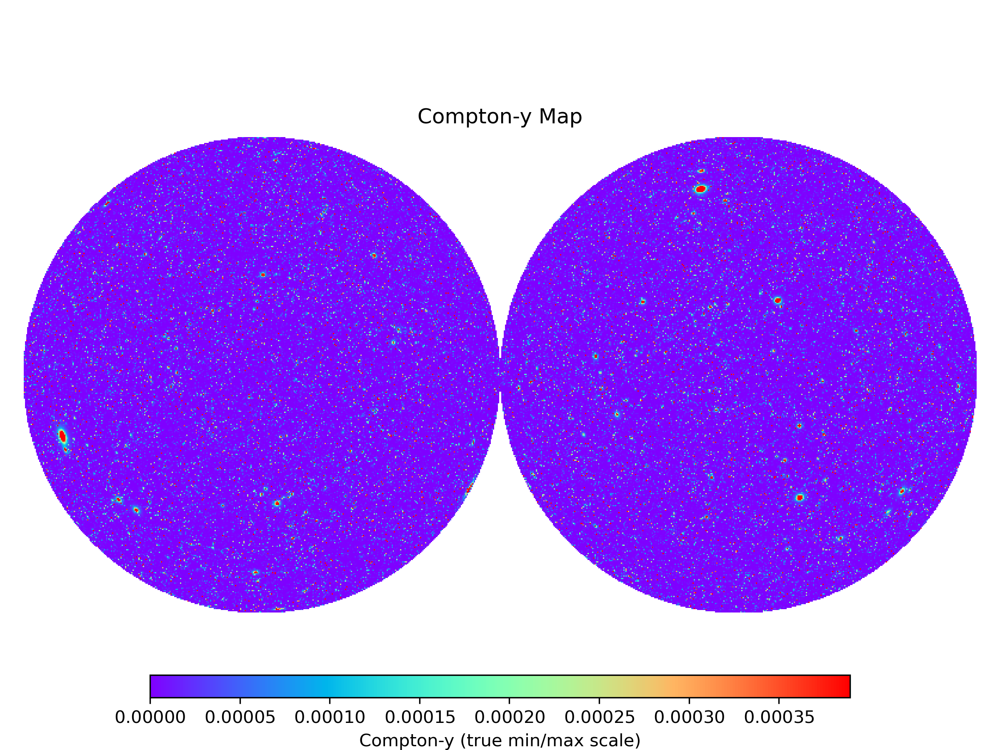
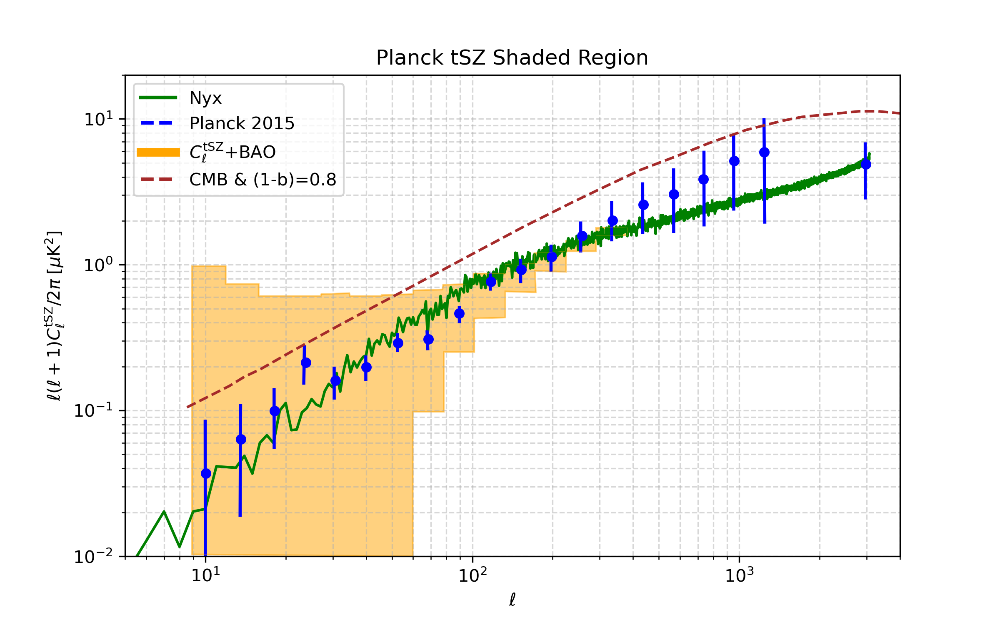

# Cosmo Suite

Welcome to **Cosmo Suite**, a collection of post-processing routines for cosmology data.

## Compton-y Map (Orthographic Projection)

## Thermal Sunyaev-Zel’dovich (tSZ) Power Spectrum

---

## About

This repository contains routines for analyzing cosmological simulations and observational data, including:

- Compton y parameter map generation
- tSZ spectrum computation
